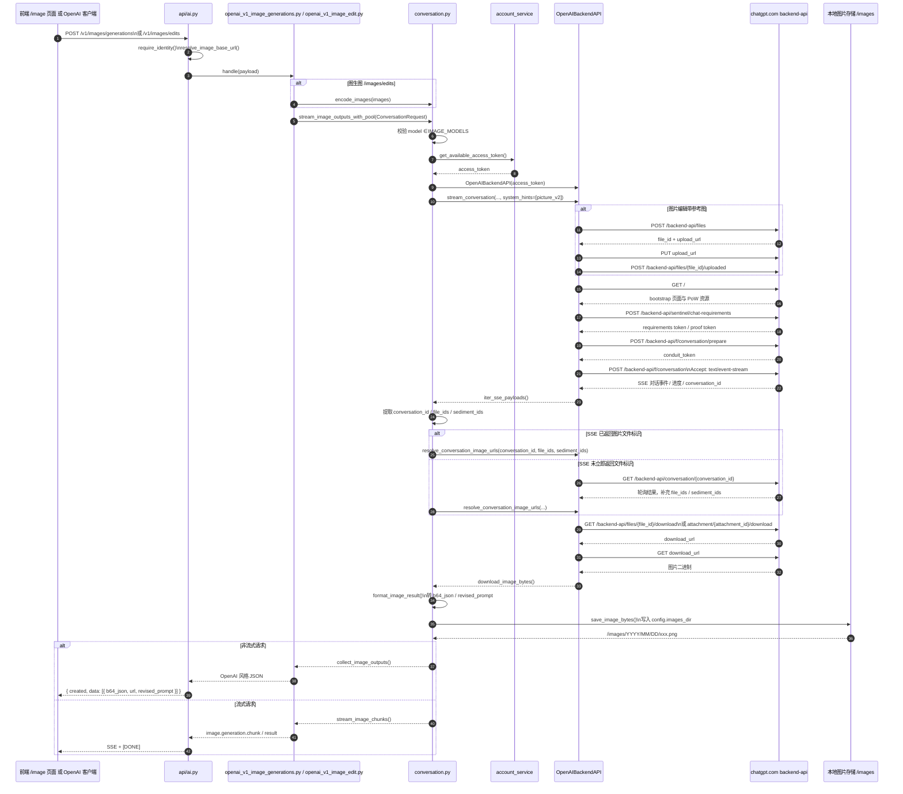

# chatgpt2api 项目中“代理 ChatGPT 画图”功能实现分析

## 1. 文档目的

本文说明本项目里“代理 ChatGPT 画图”的具体实现方式，重点回答以下问题：

1. 画图功能的后端入口在哪里。
2. 请求如何从 OpenAI 兼容接口转发到 ChatGPT Web 上游。
3. 支持哪些图片模型。
4. 图片结果如何以 `b64_json` / `url` 形式返回。
5. 前端 `/image` 页面如何调用后端并展示结果。
6. 相关测试覆盖在哪些文件。

---

## 2. 先看结论

这个项目的“代理 ChatGPT 画图”本质上不是直接调用 OpenAI 官方图片 API，而是：

- 对外暴露 **OpenAI 兼容接口**：`/v1/images/generations`、`/v1/images/edits`
- 内部再转成 **ChatGPT Web 对话链路**
- 通过 `picture_v2` 这条上游能力，向 `chatgpt.com/backend-api/...` 发起图片生成或图片编辑请求
- 拿到上游生成结果后，再包装回 OpenAI 风格的响应格式

也就是说，这里的“代理 ChatGPT 画图”实际上是：

**客户端 → 本项目 OpenAI 兼容层 → 协议转换层 → ChatGPT Web 上游图片能力 → 本项目重新包装结果 → 客户端**

---

## 3. 整体架构

```mermaid
flowchart TD
    A[前端 /image 页面 或 OpenAI 客户端] --> B[/v1/images/generations 或 /v1/images/edits]
    B --> C[api/ai.py]
    C --> D[services/protocol/openai_v1_image_generations.py 或 openai_v1_image_edit.py]
    D --> E[services/protocol/conversation.py]
    E --> F[services/openai_backend_api.py]
    F --> G[chatgpt.com backend-api]
    G --> F
    F --> E
    E --> C
    C --> A
```

如果是前端页面 `/image`，则页面调用的依然是同一组 OpenAI 兼容接口。

### 3.1 调用链路流程图

下面这张图把“前端/客户端发起图片请求”到“上游生成图片并回传结果”的完整调用链串起来了。



这张图对应的核心源码位置主要是：

- 入口路由：`api/ai.py:67`、`api/ai.py:79`
- 协议适配：`services/protocol/openai_v1_image_generations.py:13`、`services/protocol/openai_v1_image_edit.py:15`
- 核心会话链路：`services/protocol/conversation.py:458`、`services/protocol/conversation.py:532`
- 上游适配：`services/openai_backend_api.py:271`、`services/openai_backend_api.py:377`、`services/openai_backend_api.py:663`

---

## 4. 后端入口在哪里

### 4.1 路由入口

后端图片生成和图片编辑的入口在：

- `api/ai.py:67`
- `api/ai.py:79`

对应两个接口：

- `POST /v1/images/generations`
- `POST /v1/images/edits`

### 4.2 入口代码作用

`api/ai.py` 里这两个接口分别做几件事：

1. 校验鉴权 `require_identity(...)`
2. 解析请求体
3. 计算图片对外访问用的 `base_url`
4. 调用协议层：
   - `services.protocol.openai_v1_image_generations.handle(...)`
   - `services.protocol.openai_v1_image_edit.handle(...)`

相关代码位置：

- `api/ai.py:67-77` 文生图入口
- `api/ai.py:79-115` 图生图入口

### 4.3 应用挂载位置

这些路由最终在应用中被挂载到 FastAPI：

- `api/app.py:38`

同时，项目还会把图片目录挂载成静态资源：

- `api/app.py:42-43`

即：

```python
app.mount("/images", StaticFiles(directory=str(config.images_dir)), name="images")
```

这意味着生成后的图片如果被落地保存，就可以通过 `/images/...` 访问。

---

## 5. OpenAI 兼容接口如何转发到上游

## 5.1 `/v1/images/generations` 调用链

文生图主链路如下：

1. `api/ai.py:68-77` `generate_images(...)`
2. `services/protocol/openai_v1_image_generations.py:13-31` `handle(...)`
3. `services/protocol/conversation.py:532-583` `stream_image_outputs_with_pool(...)`
4. `services/protocol/conversation.py:458-530` `stream_image_outputs(...)`
5. `services/protocol/conversation.py:418-438` `conversation_events(...)`
6. `services/openai_backend_api.py:632-679` `OpenAIBackendAPI.stream_conversation(...)`
7. `services/openai_backend_api.py:663-679` `_stream_picture_conversation(...)`

### 5.1.1 协议层做了什么

`services/protocol/openai_v1_image_generations.py` 主要把 OpenAI 风格请求转换为内部统一结构 `ConversationRequest`：

- 读取 `prompt`
- 读取 `model`
- 读取 `n`
- 读取 `size`
- 读取 `response_format`
- 读取 `base_url`

然后交给：

- `stream_image_outputs_with_pool(...)`

如果请求是流式，则走：

- `stream_image_chunks(outputs)`

否则走：

- `collect_image_outputs(outputs)`

### 5.1.2 为什么会走图片链路

在 `services/protocol/conversation.py:426-438` 中，代码会判断当前模型是否属于图片模型：

- `image_model = str(model or "").strip() in IMAGE_MODELS`

如果是图片模型，就会在调用上游时带上：

- `system_hints=["picture_v2"]`

也就是：

```python
payloads = backend.stream_conversation(
    messages=normalized,
    model=model,
    prompt=final_prompt,
    images=images if image_model else None,
    system_hints=["picture_v2"] if image_model else None,
)
```

这个 `picture_v2` 是整个图片代理链路的关键开关。

---

## 5.2 `/v1/images/edits` 调用链

图生图和文生图的总体链路一致，只是多了一步上传参考图片：

1. `api/ai.py:79-115` `edit_images(...)`
2. `services/protocol/openai_v1_image_edit.py:15-38` `handle(...)`
3. `services/protocol/conversation.py:57-58` `encode_images(...)`
4. `services/protocol/conversation.py:532-583` `stream_image_outputs_with_pool(...)`
5. 后续进入同一条图片生成链路

### 5.2.1 图生图入口如何处理上传图片

`api/ai.py:83-103` 会把上传文件读成：

```python
(bytes, filename, content_type)
```

然后在 `openai_v1_image_edit.handle(...)` 中调用：

- `encode_images(images)`

把图片二进制转成 base64 字符串，再传入统一的对话请求结构。

---

## 5.3 上游到底调用了什么接口

真正和 ChatGPT Web 通信的是：

- `services/openai_backend_api.py`

图片链路会调用以下上游接口：

### 5.3.1 首页预热

- `GET https://chatgpt.com/`

对应代码：

- `services/openai_backend_api.py:681-692` `_bootstrap(...)`

作用：

- 预热会话
- 提取 PoW 所需脚本资源

### 5.3.2 获取 chat requirements

- `POST /backend-api/sentinel/chat-requirements`

对应代码：

- `services/openai_backend_api.py:693-709` `_get_chat_requirements(...)`

作用：

- 获取 sentinel token
- 获取 proof token / turnstile token / so token

### 5.3.3 准备图片对话

- `POST /backend-api/f/conversation/prepare`

对应代码：

- `services/openai_backend_api.py:271-300` `_prepare_image_conversation(...)`

作用：

- 为图片生成准备 `conduit_token`
- 指定 `system_hints=["picture_v2"]`

### 5.3.4 发起图片生成或图片编辑

- `POST /backend-api/f/conversation`

对应代码：

- `services/openai_backend_api.py:377-448` `_start_image_generation(...)`

这个请求采用 SSE：

- `Accept: text/event-stream`

如果带参考图，则消息内容会被构造成 `multimodal_text.parts`，其中图片部分是：

- `image_asset_pointer`

### 5.3.5 轮询 conversation 获取图片结果

如果 SSE 中没有立即拿到结果文件 ID，代码会继续请求：

- `GET /backend-api/conversation/{conversation_id}`

对应代码：

- `services/openai_backend_api.py:490-516` `_poll_image_results(...)`

### 5.3.6 解析下载地址

图片结果最终会通过以下两个接口之一获取下载地址：

- `GET /backend-api/files/{file_id}/download`
- `GET /backend-api/conversation/{conversation_id}/attachment/{attachment_id}/download`

对应代码：

- `services/openai_backend_api.py:518-535`
- `services/openai_backend_api.py:536-623`

### 5.3.7 下载图片二进制

解析出下载 URL 后，再下载图片二进制：

- `services/openai_backend_api.py:624-630` `download_image_bytes(...)`

---

## 6. 图生图是如何上传参考图片的

如果是 `/v1/images/edits` 或其他带参考图的图片请求，上游适配层会先上传图片。

相关代码：

- `services/openai_backend_api.py:317-375` `_upload_image(...)`

过程如下：

1. 把 base64 或本地文件路径解码成二进制
2. 读取图片宽高和 MIME 类型
3. 请求：`POST /backend-api/files`
4. 根据返回的 `upload_url` 执行 `PUT`
5. 再调用 `POST /backend-api/files/{file_id}/uploaded` 确认上传完成
6. 把返回的 `file_id` 作为图片引用塞进图片对话请求

在真正发起图片生成时，参考图会进入：

- `image_asset_pointer`
- `attachments`

对应位置：

- `services/openai_backend_api.py:381-406`

---

## 7. 当前支持哪些图片模型

### 7.1 明确支持的模型

图片模型常量定义在：

- `utils/helper.py:14`

代码如下：

```python
IMAGE_MODELS = {"gpt-image-2", "codex-gpt-image-2"}
```

同时，在：

- `services/protocol/conversation.py:533-535`

有严格校验：

```python
if str(request.model or "").strip() not in IMAGE_MODELS:
    raise ImageGenerationError("unsupported image model,supported models: " + ", ".join(IMAGE_MODELS))
```

因此当前图片接口明确只支持：

- `gpt-image-2`
- `codex-gpt-image-2`

### 7.2 上游模型映射关系

在：

- `services/openai_backend_api.py:244-253` `_image_model_slug(...)`

存在模型映射：

- `gpt-image-2` → `gpt-5-3`
- `codex-gpt-image-2` → `codex-gpt-image-2`
- 其他 → `auto`

所以可以理解为：

- 外部兼容层让用户用 `gpt-image-2`
- 上游真正提交时会映射成 ChatGPT Web 能识别的底层 slug `gpt-5-3`

### 7.3 不支持的模型

从当前代码看，没有看到以下模型的正式兼容实现：

- `gpt-image-1`
- `dall-e-2`
- `dall-e-3`
- 其他 DALL·E 变体

因此不能把项目当前图片代理能力理解为“兼容全部 OpenAI 图片模型”，而应理解为“兼容一小组内部约定的图片模型名”。

---

## 8. 图片结果如何返回

## 8.1 统一格式化入口

图片结果的统一格式化逻辑在：

- `services/protocol/conversation.py:149-177` `format_image_result(...)`

这个函数会把上游下载到的图片字节先转成 `b64_json`，然后再根据 `response_format` 决定最终响应内容。

---

## 8.2 `b64_json` 返回逻辑

如果请求带的是：

- `response_format = "b64_json"`

则每个图片项会返回：

```json
{
  "b64_json": "...",
  "url": "...",
  "revised_prompt": "..."
}
```

也就是说，即使客户端要求的是 `b64_json`，代码仍然会额外保存图片，并补一个可访问的 `url`。

相关代码：

- `services/protocol/conversation.py:163-168`

---

## 8.3 `url` 返回逻辑

如果不是 `b64_json` 模式，则返回：

```json
{
  "url": "...",
  "revised_prompt": "..."
}
```

相关代码：

- `services/protocol/conversation.py:169-173`

---

## 8.4 图片如何落地保存

保存逻辑在：

- `services/protocol/conversation.py:61-69` `save_image_bytes(...)`

实现方式：

1. 对图片字节做 `md5`
2. 生成文件名：`时间戳_md5.png`
3. 按日期组织目录：`YYYY/MM/DD`
4. 写入 `config.images_dir`
5. 返回静态访问 URL

生成出来的 URL 格式大致是：

```text
{base_url}/images/YYYY/MM/DD/filename.png
```

---

## 8.5 `base_url` 从哪里来

图片 URL 的基础域名由以下函数决定：

- `api/support.py:49-50` `resolve_image_base_url(...)`

逻辑：

1. 优先使用 `config.base_url`
2. 如果没有配置，则使用当前请求的 `scheme://host`

因此图片 URL 是否正确，和服务部署时的域名配置直接相关。

---

## 8.6 流式返回格式

流式图片响应在：

- `services/protocol/conversation.py:586-588` `stream_image_chunks(...)`
- `utils/helper.py:41-56` `sse_json_stream(...)`

图片流式事件对象主要有三种：

- `image.generation.chunk`
- `image.generation.message`
- `image.generation.result`

其中：

- `progress` 类型用于上游处理中间态
- `message` 类型用于上游给出文本说明但没有生成图片的场景
- `result` 类型用于真正返回图片数据

最后会以标准 SSE 形式输出：

```text
data: {...}

data: [DONE]
```

---

## 9. 上游失败和审核拒绝如何处理

图片生成有一种特殊情况：上游没有真正生成图片，而是只返回一段文本说明。

在：

- `services/protocol/conversation.py:553-559`

如果当前请求设置了 `message_as_error=True`，那么一旦上游只返回 message，不返回图片，就会被转成 OpenAI 风格错误：

- `status_code = 400`
- `error_type = "invalid_request_error"`
- `code = "content_policy_violation"`

也就是说，图片接口不是简单透传上游文本，而是会主动把这类“被拒绝生成”的结果转换成统一错误。

---

## 10. `/v1/chat/completions` 如何间接支持画图

除了专门的图片接口之外，项目还支持通过 Chat Completions 触发图片生成。

相关文件：

- `services/protocol/openai_v1_chat_complete.py`
- `utils/helper.py`

### 10.1 什么时候会判定为图片请求

在：

- `utils/helper.py:22-27` `is_image_chat_request(...)`

满足任一条件时会进入图片链路：

1. `model in IMAGE_MODELS`
2. `modalities` 里包含 `image`

### 10.2 返回格式有什么不同

Chat Completions 不会像 `/v1/images/generations` 那样返回 `data[]`，而是把图片包装进 assistant 文本内容。

相关代码：

- `utils/helper.py:238-247` `build_chat_image_markdown_content(...)`
- `services/protocol/openai_v1_chat_complete.py:117-145`

输出形式类似：

```markdown

```

因此 `/v1/chat/completions` 的图片能力，本质上是“把生成后的图片嵌进 markdown 文本中”。

---

## 11. `/v1/responses` 如何间接支持画图

项目还兼容了 Responses API 中的图片生成。

相关文件：

- `services/protocol/openai_v1_response.py`

### 11.1 如何识别图片生成请求

在：

- `utils/helper.py:139-146` `has_response_image_generation_tool(...)`

如果请求里带有：

```json
{"type": "image_generation"}
```

或者 `tool_choice.type == "image_generation"`，就会进入图片生成逻辑。

### 11.2 返回格式

Responses 风格里会把图片包装成：

- `type: "image_generation_call"`
- `result: <base64>`

对应代码：

- `services/protocol/openai_v1_response.py:85-97` `image_output_items(...)`

因此它和 `/v1/images/generations` 的差别是：

- `/v1/images/generations` 返回 `data[]`
- `/v1/responses` 返回 `output[]`，其中图片项类型为 `image_generation_call`

---

## 12. 前端 `/image` 页面如何实现

前端页面入口在：

- `web/src/app/image/page.tsx`

图片展示组件在：

- `web/src/app/image/components/image-results.tsx`

本地历史存储在：

- `web/src/store/image-conversations.ts`

接口调用封装在：

- `web/src/lib/api.ts`

---

## 12.1 前端调用哪个后端接口

在：

- `web/src/lib/api.ts:194-208` `generateImage(...)`
- `web/src/lib/api.ts:210-233` `editImage(...)`

前端调用逻辑如下：

### 文生图

请求：

- `POST /v1/images/generations`

请求体：

```json
{
  "prompt": "...",
  "model": "gpt-image-2",
  "size": "...",
  "n": 1,
  "response_format": "b64_json"
}
```

### 图生图

请求：

- `POST /v1/images/edits`

请求体：

- `FormData`
- 包含多个 `image`
- `prompt`
- `model`
- `size`
- `n=1`

可以看到，前端默认固定使用：

- `response_format = "b64_json"`

也就是说，前端主流程并不依赖后端返回的 `url`。

---

## 12.2 前端如何支持多张图

前端页面并不是一次性向后端传 `n=10`，而是自己维护一个队列。

关键逻辑在：

- `web/src/app/image/page.tsx:527-722` `runConversationQueue(...)`
- `web/src/app/image/page.tsx:736-798` `handleSubmit(...)`

实现方式：

1. 用户输入想要的图片数量
2. 前端先创建多个 `loading` 占位图
3. 对每一张待生成图片，分别调用一次：
   - `generateImage(...)`
   - 或 `editImage(...)`
4. 逐张把结果回填到本地会话中

因此这里的“多图”是：

**前端多次请求实现**

而不是：

**后端单次请求返回多张图**

虽然后端接口支持 `n`，但这个前端页面当前固定每次请求 `n: 1`。

---

## 12.3 前端如何处理参考图

关键函数：

- `web/src/app/image/page.tsx:74-80` `readFileAsDataUrl(...)`
- `web/src/app/image/page.tsx:83-92` `dataUrlToFile(...)`
- `web/src/app/image/page.tsx:94-104` `buildReferenceImageFromResult(...)`
- `web/src/app/image/page.tsx:444-478` `appendReferenceImages(...)`
- `web/src/app/image/page.tsx:492-513` `handleContinueEdit(...)`

流程如下：

1. 用户上传参考图
2. 前端读成 data URL 用于预览
3. 同时把 `File[]` 保留下来，供提交给 `/v1/images/edits`
4. 如果用户想基于已有生成结果继续编辑，则把已有 `b64_json` 拼成 data URL
5. 再转回 `File`，继续作为新的参考图提交

这意味着页面支持一种连续工作流：

- 文生图 → 选中结果图 → 加入编辑 → 再次图生图

---

## 12.4 前端如何展示图片结果

展示逻辑在：

- `web/src/app/image/components/image-results.tsx:147-193`

成功结果图直接使用：

```tsx
src={`data:image/png;base64,${image.b64_json}`}
```

也就是：

- 页面直接渲染 base64 data URL
- 不依赖后端静态图片 URL

同时它还会在图片加载后读取：

- `naturalWidth`
- `naturalHeight`

并展示图片尺寸和估算大小。

---

## 12.5 前端历史记录保存在哪里

本地会话历史保存在：

- `web/src/store/image-conversations.ts`

底层使用：

- `localforage`

相关代码：

- `web/src/store/image-conversations.ts:51-56`

保存内容包括：

- 会话标题
- 每一轮 prompt
- 生成模式（文生图 / 图生图）
- 参考图 data URL
- 每张图片的 `b64_json`
- 当前任务状态（queued / generating / success / error）

因此这个 image 页面是：

**前端本地历史 + 前端任务队列驱动**

不是服务端任务表驱动。

---

## 13. 关键文件清单

## 13.1 后端接口层

- `api/ai.py`  OpenAI 兼容图片接口入口
- `api/app.py`  挂载路由与 `/images` 静态资源
- `api/support.py`  解析图片 `base_url`

## 13.2 协议转换层

- `services/protocol/openai_v1_image_generations.py`  文生图协议适配
- `services/protocol/openai_v1_image_edit.py`  图生图协议适配
- `services/protocol/openai_v1_chat_complete.py`  Chat Completions 图片兼容
- `services/protocol/openai_v1_response.py`  Responses 图片兼容
- `services/protocol/conversation.py`  核心图片流转、结果格式化、错误转换

## 13.3 上游适配层

- `services/openai_backend_api.py`  ChatGPT Web 上游调用封装

## 13.4 前端层

- `web/src/lib/api.ts`  前端图片接口调用封装
- `web/src/app/image/page.tsx`  图片工作台页面
- `web/src/app/image/components/image-results.tsx`  图片结果展示
- `web/src/store/image-conversations.ts`  本地历史与队列状态存储

## 13.5 工具与常量

- `utils/helper.py`  图片模型常量、SSE 包装、图片请求识别

---

## 14. 相关测试文件

下面这些文件覆盖了图片代理功能的核心路径。

### 14.1 `/v1/images/generations`

- `test/test_v1_images_generations.py`
- `test/test_generations.py`
- `test/test_generations_url.py`

覆盖点：

- 非流式图片生成
- 流式图片生成
- `response_format = "url"` 的场景

### 14.2 `/v1/images/edits`

- `test/test_v1_images_edits.py`

覆盖点：

- 单图编辑
- 多参考图上传
- 流式图生图

### 14.3 Chat Completions 的图片能力

- `test/test_v1_chat_completions.py`

覆盖点：

- `model = gpt-image-2` 时的图片请求
- 非流式 markdown/data-url 输出
- 流式 delta 拼接后的图片提取

### 14.4 Responses 的图片能力

- `test/test_v1_responses.py`

覆盖点：

- `tools=[{"type":"image_generation"}]`
- 非流式图片生成
- 流式 `response.output_item.done`
- `codex-gpt-image-2` 路径

---

## 15. 这套实现的关键特点

## 15.1 优点

1. **对外接口统一**  
   对客户端暴露标准 OpenAI 风格接口，便于兼容现有 SDK 和前端调用方式。

2. **内部复用同一条图片链路**  
   `/v1/images/generations`、`/v1/images/edits`、`/v1/chat/completions`、`/v1/responses` 最终都汇聚到同一个核心图片对话链路。

3. **同时支持 base64 和静态 URL**  
   即使请求 `b64_json`，系统也会额外持久化图片，方便后续管理或外链访问。

4. **前端体验完整**  
   前端支持本地历史、多图队列、从已有结果继续编辑。

## 15.2 限制

1. **模型兼容范围并不广**  
   当前只明确支持 `gpt-image-2` 和 `codex-gpt-image-2`。

2. **依赖 ChatGPT Web 上游行为**  
   如果上游接口、字段、token 校验或 SSE 结构发生变化，这条链路可能会受影响。

3. **前端多图不是后端批量生成**  
   当前页面的多图能力是前端拆成多次请求实现的。

4. **图片页面主要依赖 base64 展示**  
   虽然后端会返回 URL，但当前页面没有把 URL 作为主渲染路径。

---

## 16. 最终总结

这个项目里的“代理 ChatGPT 画图”功能，核心并不是直接调用 OpenAI 官方图片服务，而是：

- 对外提供 OpenAI 兼容图片接口
- 对内把请求改写成 ChatGPT Web 的 `picture_v2` 对话请求
- 使用 ChatGPT Web 的 conversation / files / attachment 下载链路拿回图片
- 再包装成 OpenAI 风格返回

具体来说：

- 图片入口在 `api/ai.py`
- 核心协议逻辑在 `services/protocol/conversation.py`
- 上游适配在 `services/openai_backend_api.py`
- 前端图片工作台在 `web/src/app/image/page.tsx`
- 结果展示主要使用 `b64_json`
- 当前明确支持 `gpt-image-2` 与 `codex-gpt-image-2`

如果后续还要继续深入，建议下一步重点看这几个函数：

1. `services/openai_backend_api.py::_prepare_image_conversation`
2. `services/openai_backend_api.py::_start_image_generation`
3. `services/protocol/conversation.py::stream_image_outputs`
4. `services/protocol/conversation.py::format_image_result`
5. `web/src/app/image/page.tsx::runConversationQueue`

这几个位置基本覆盖了“请求怎么发、结果怎么收、前端怎么呈现”的核心逻辑。
